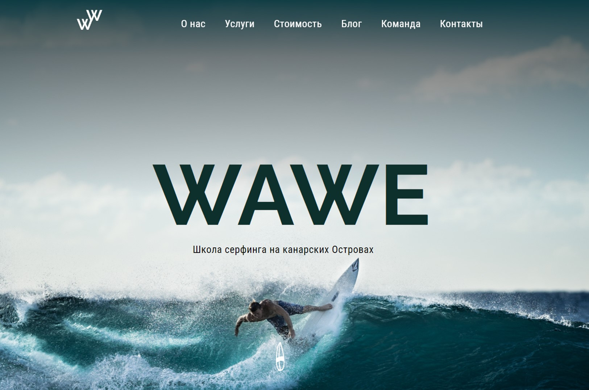

# Верстка лендинга школы серфинга на канарских Островах WAWE

Учебный проект [курса верстки сайтов ОТ 0 ДО 1](https://from0to1.com.ua/).

## **Описание проекта**

* Сверстан лендинг по макету из Figma
* Адаптивная верстка для экранов 320px и выше
* Верстка валидная, семантическая
* Добавлен слайдер с использованием Slick Slider
* Всплывающее окно для видео реализовано с помощью плагина FancyBox
* Сортировка изображений галлереи с помощью плагина MixItUp

## **Стек технологий**

## [**Демо**](https://alekseeva-t-v.github.io/wawe/)
